# 代码站游戏盒子

代码站游戏盒子是一个微信小游戏盒子，里面涵盖多种游戏。
现有游戏：
2048、井字棋、记忆翻牌、数字拼图、找不同、数字消除、五子棋、打飞机、打砖块、推箱子……


更多源码请联系微信：diamazhan，小程序：代码站

## 提交规范

| 类型     | 说明                       |
| -------- | -------------------------- |
| feat     | 新功能                     |
| fix      | Bug 修复                   |
| docs     | 文档变更                   |
| style    | 代码格式（不影响逻辑）     |
| refactor | 重构（非修复亦非新增功能） |
| perf     | 性能优化                   |
| test     | 测试相关                   |
| build    | 构建系统或依赖变动         |
| chore    | 其他辅助变动               |

## 预览
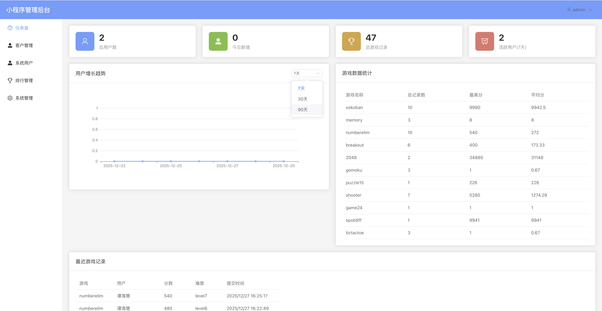

| 预览 | 预览 | 预览 | 
| ---- | ---- | ---- | 
|  | 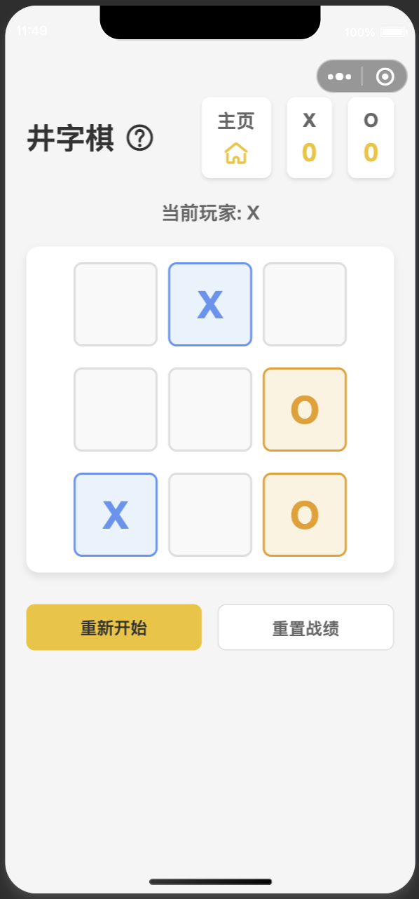 | 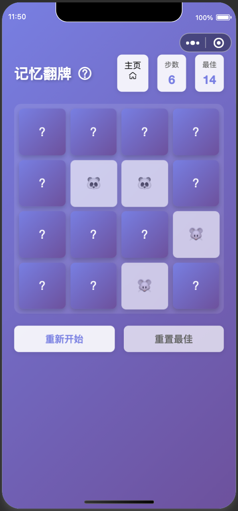 |
| 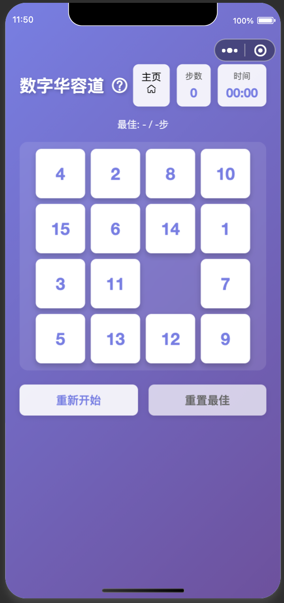 | 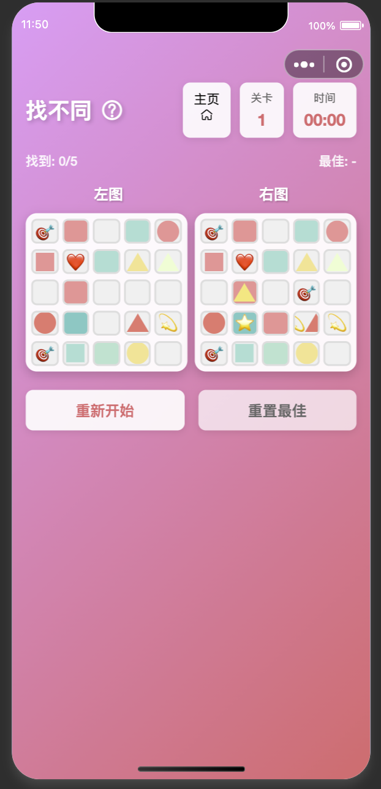 | 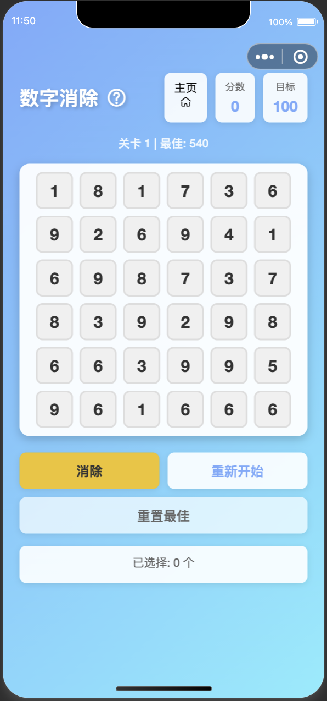 |
| 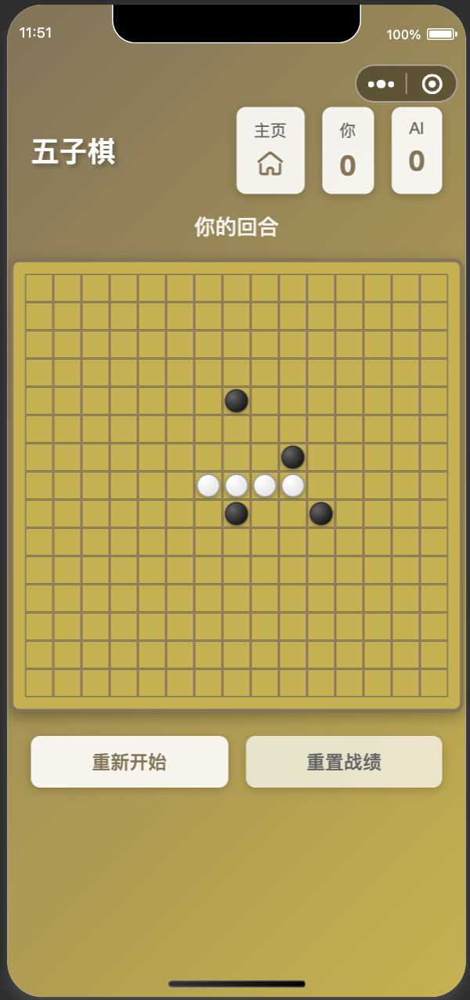 | 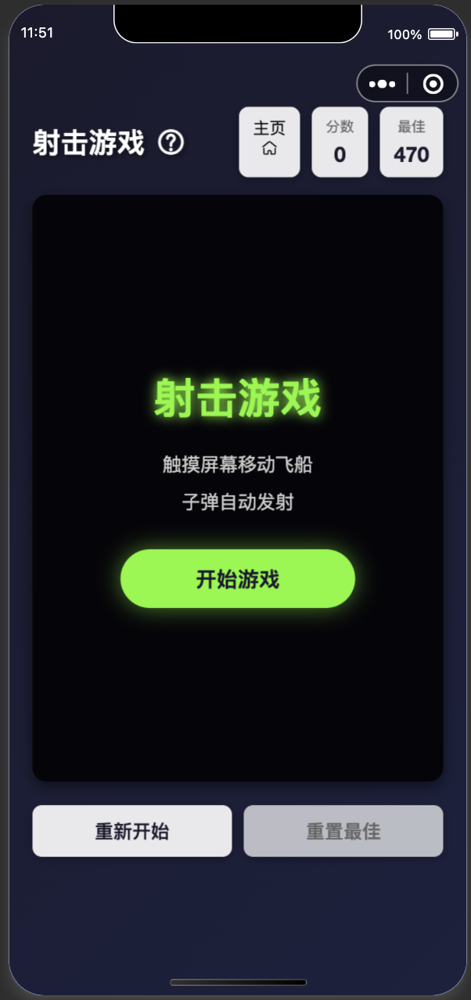 | 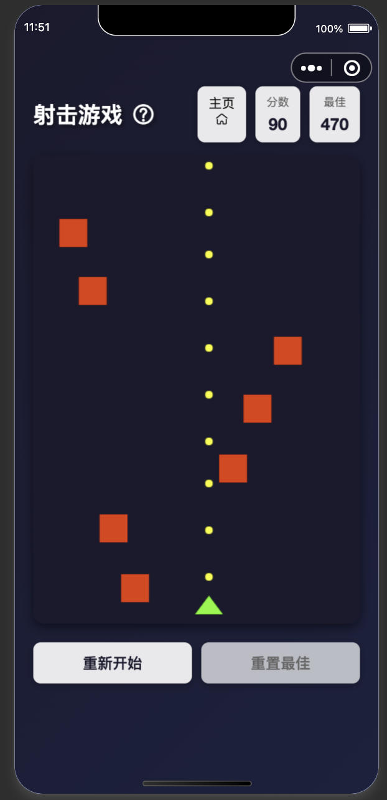 |
| 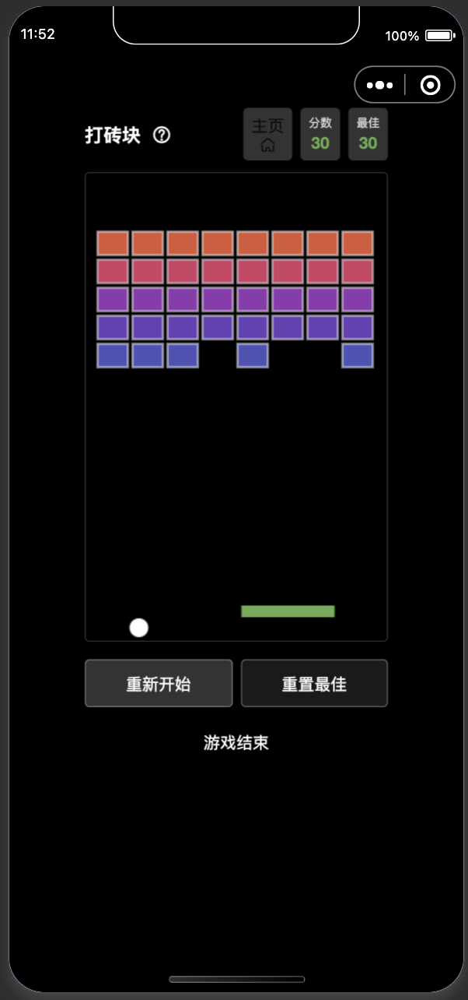 | 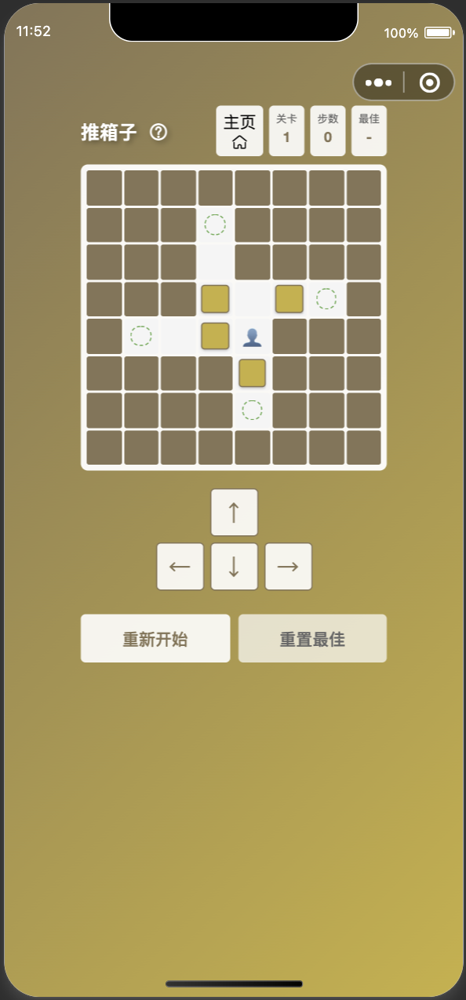 | 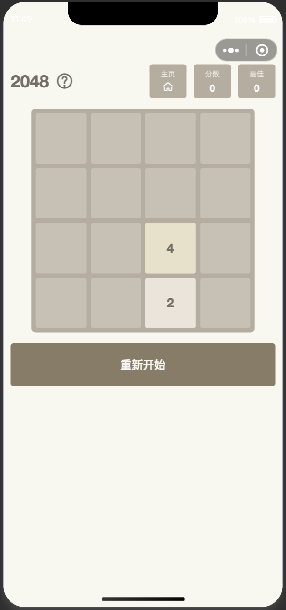 |


# 小程序游戏商店后端服务

基于 Java 21、Spring Boot 3.2.0 开发的小程序后端服务。

## 技术栈

- **Java**: 21
- **Spring Boot**: 3.2.0
- **MyBatis Plus**: 3.5.5
- **MySQL**: 8.0.33
- **Sa-Token**: 1.37.0
- **ip2region**: 2.7.0
- **weixin-java-miniapp**: 4.5.0

## 项目结构

```
src/
├── main/
│   ├── java/
│   │   └── com/ob/minigame/
│   │       ├── config/          # 配置类
│   │       ├── controller/      # 控制器
│   │       ├── service/         # 服务层
│   │       ├── mapper/          # Mapper 接口
│   │       ├── entity/          # 实体类
│   │       ├── dto/             # 数据传输对象
│   │       ├── vo/              # 视图对象
│   │       ├── common/          # 公共类
│   │       └── util/            # 工具类
│   └── resources/
│       ├── mapper/              # MyBatis XML 映射文件
│       ├── application.yml      # 主配置文件
│       └── application-dev.yml  # 开发环境配置
└── test/
    └── java/                    # 测试代码
```

## 快速开始

### 1. 环境要求

- JDK 21+
- Maven 3.6+
- MySQL 8.0+

### 2. 配置数据库

修改 `src/main/resources/application.yml` 中的数据库配置：

```yaml
spring:
  datasource:
    url: jdbc:mysql://localhost:3306/mini_game_store?useUnicode=true&characterEncoding=utf8&useSSL=false&serverTimezone=Asia/Shanghai
    username: your-username
    password: your-password
```

### 3. 配置微信小程序

修改 `src/main/resources/application.yml` 中的微信小程序配置：

```yaml
wechat:
  miniapp:
    appid: your-appid
    secret: your-secret
```

### 4. 运行项目

```bash
# 编译项目
mvn clean compile

# 运行项目
mvn spring-boot:run
```

或者使用 IDE 直接运行 `MiniGameStoreApplication` 主类。

### 5. 访问接口

服务启动后，访问地址：http://localhost:8080/api

测试接口：
- 健康检查：GET http://localhost:8080/api/test/health
- IP 信息：GET http://localhost:8080/api/test/ip
- 微信登录：POST http://localhost:8080/api/auth/wxLogin?code=xxx

## 主要功能

### 1. 认证授权（Sa-Token）

- 基于 Sa-Token 实现登录认证
- 支持微信小程序登录
- 自动拦截需要登录的接口

### 2. 数据持久化（MyBatis Plus）

- 集成 MyBatis Plus，简化 CRUD 操作
- 支持分页查询
- 支持逻辑删除
- 自动填充创建时间和更新时间

### 3. IP 定位（ip2region）

- 根据 IP 地址获取地区信息
- 支持获取客户端真实 IP

### 4. 微信小程序集成

- 支持微信小程序登录
- 获取用户 openid 和 session_key

## 开发说明

### 创建实体类

继承 `BaseEntity` 类，自动包含 id、createTime、updateTime、deleted 字段：

```java
@Data
@TableName("user")
public class User extends BaseEntity {
    private String openid;
    private String nickname;
    // ...
}
```

### 创建 Mapper

继承 `BaseMapper` 接口：

```java
@Mapper
public interface UserMapper extends BaseMapper<User> {
    // 自定义查询方法
}
```

### 创建 Service

```java
@Service
public class UserService extends ServiceImpl<UserMapper, User> {
    // 业务逻辑
}
```

### 统一响应格式

使用 `Result` 类统一返回格式：

```java
return Result.success(data);
return Result.error("错误信息");
```

## 注意事项

1. 确保 MySQL 数据库已创建，数据库名为 `mini_game_store`
2. 需要下载 ip2region.db 文件并放到 resources 目录
3. 配置正确的微信小程序 appid 和 secret
4. 生产环境建议修改 application-prod.yml 中的数据库配置


# 管理后台 API 文档

## 概述

本文档描述了管理后台的所有 API 接口。所有管理后台接口都需要登录认证（使用 `@SaCheckLogin` 注解），路径前缀为 `/sys`。

## 1. Dashboard（仪表盘）

### 1.1 获取仪表盘概览数据
- **接口**: `GET /sys/dashboard/overview`
- **说明**: 获取总用户数、今日新增用户、总游戏记录数、今日游戏记录数、活跃用户数等
- **返回数据**:
  ```json
  {
    "code": 200,
    "message": "操作成功",
    "data": {
      "totalUsers": 1000,
      "todayNewUsers": 10,
      "totalGameRecords": 5000,
      "todayGameRecords": 50,
      "activeUsers": 200
    }
  }
  ```

### 1.2 获取用户增长趋势
- **接口**: `GET /sys/dashboard/userGrowth?days=30`
- **参数**: `days` - 查询天数（默认30天）
- **返回数据**: 按日期统计的用户增长数据

### 1.3 获取游戏数据统计
- **接口**: `GET /sys/dashboard/gameStatistics`
- **说明**: 按游戏名称统计总记录数、总分数、最高分、平均分等
- **返回数据**: 各游戏的统计数据

### 1.4 获取最近游戏记录
- **接口**: `GET /sys/dashboard/recentRecords?limit=10`
- **参数**: `limit` - 返回数量（默认10条）

## 2. 客户管理（CustomUser）

### 2.1 分页查询客户列表
- **接口**: `GET /sys/customer/page?current=1&size=10&keyword=`
- **参数**:
  - `current` - 当前页码（默认1）
  - `size` - 每页数量（默认10）
  - `keyword` - 搜索关键词（可选，搜索昵称或openid）

### 2.2 根据ID获取客户详情
- **接口**: `GET /sys/customer/{id}`

### 2.3 根据openid获取客户详情
- **接口**: `GET /sys/customer/openid/{openid}`

### 2.4 更新客户信息
- **接口**: `PUT /sys/customer/{id}`
- **请求体**: CustomUser 对象

### 2.5 删除客户
- **接口**: `DELETE /sys/customer/{id}`

### 2.6 批量删除客户
- **接口**: `DELETE /sys/customer/batch`
- **请求体**: `{"ids": [1, 2, 3]}`

## 3. 系统用户管理（SysUser）

### 3.1 分页查询系统用户列表
- **接口**: `GET /sys/user/page?current=1&size=10&keyword=&role=&status=`
- **参数**:
  - `current` - 当前页码
  - `size` - 每页数量
  - `keyword` - 搜索关键词（可选）
  - `role` - 角色筛选（可选：admin/operator）
  - `status` - 状态筛选（可选：0-禁用，1-启用）

### 3.2 根据ID获取系统用户详情
- **接口**: `GET /sys/user/{id}`

### 3.3 创建系统用户
- **接口**: `POST /sys/user`
- **请求体**: SysUser 对象（包含密码，会自动加密）

### 3.4 更新系统用户
- **接口**: `PUT /sys/user/{id}`
- **请求体**: SysUser 对象（密码为空则不更新密码）

### 3.5 删除系统用户
- **接口**: `DELETE /sys/user/{id}`

### 3.6 批量删除系统用户
- **接口**: `DELETE /sys/user/batch`
- **请求体**: `{"ids": [1, 2, 3]}`

### 3.7 启用/禁用系统用户
- **接口**: `PUT /sys/user/{id}/status`
- **请求体**: `{"status": 1}` （0-禁用，1-启用）

## 4. 排行管理（GameRanking）

### 4.1 分页查询排行记录
- **接口**: `GET /sys/ranking/page?current=1&size=10&gameName=&openid=&difficulty=`
- **参数**:
  - `current` - 当前页码
  - `size` - 每页数量
  - `gameName` - 游戏名称（可选）
  - `openid` - 用户openid（可选）
  - `difficulty` - 难度等级（可选）

### 4.2 获取游戏排行榜
- **接口**: `GET /sys/ranking/list?gameName=shooter&difficulty=&limit=100`
- **参数**:
  - `gameName` - 游戏名称（必填）
  - `difficulty` - 难度等级（可选）
  - `limit` - 返回数量（默认100）

### 4.3 获取游戏统计信息
- **接口**: `GET /sys/ranking/statistics?gameName=`
- **参数**: `gameName` - 游戏名称（可选，为空则统计所有游戏）
- **返回数据**: 总记录数、最高分、平均分等

### 4.4 删除排行记录
- **接口**: `DELETE /sys/ranking/{id}`

### 4.5 批量删除排行记录
- **接口**: `DELETE /sys/ranking/batch`
- **请求体**: `{"ids": [1, 2, 3]}`

## 5. 系统管理（System）

### 5.1 获取系统信息
- **接口**: `GET /sys/system/info`
- **返回数据**: Java版本、操作系统信息、JVM内存信息等

### 5.2 获取系统配置
- **接口**: `GET /sys/system/config`
- **返回数据**: 应用名称、版本号、维护状态等

## 6. 小程序端游戏接口

### 6.1 提交游戏成绩
- **接口**: `POST /game/submitScore`
- **认证**: 需要登录（`@SaCheckLogin`）
- **请求体**:
  ```json
  {
    "gameName": "shooter",
    "score": 1000,
    "duration": 120,
    "difficulty": "easy",
    "extraData": "{\"level\": 5}"
  }
  ```
- **返回数据**: 排行记录、排名、是否新纪录等

### 6.2 获取游戏排行榜
- **接口**: `GET /game/ranking?gameName=shooter&difficulty=&limit=100`
- **说明**: 公开接口，无需登录
- **参数**: 同管理后台的排行查询接口

### 6.3 获取用户最佳成绩
- **接口**: `GET /game/bestScore?gameName=shooter&difficulty=`
- **认证**: 需要登录
- **说明**: 获取当前用户在该游戏中的最佳成绩

## 数据库表结构

### game_ranking 表
- `id` - 主键ID
- `game_name` - 游戏名称
- `user_id` - 用户ID（关联custom_user表）
- `openid` - 用户openid
- `nickname` - 用户昵称
- `avatar_url` - 用户头像
- `score` - 游戏分数
- `duration` - 游戏时长（秒）
- `difficulty` - 游戏难度/等级
- `extra_data` - 额外数据（JSON格式）
- `submit_time` - 提交时间
- `create_time` - 创建时间
- `update_time` - 更新时间
- `deleted` - 逻辑删除标识

## 注意事项

1. 所有管理后台接口都需要先通过 `/sys/auth/login` 登录获取 token
2. 小程序端提交成绩接口需要先通过 `/auth/wxLogin` 登录
3. 排行榜按分数降序排列，分数相同则按提交时间升序（先提交的排名靠前）
4. 所有删除操作都是逻辑删除（设置 deleted=1）
5. 系统用户密码使用 MD5 加密（生产环境建议使用 BCrypt）


## License

MIT
